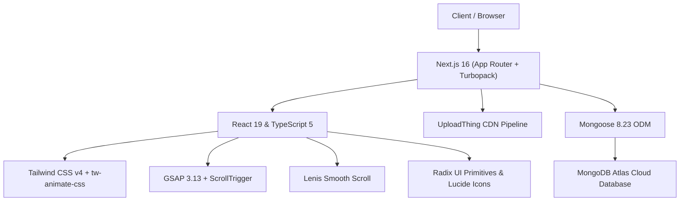
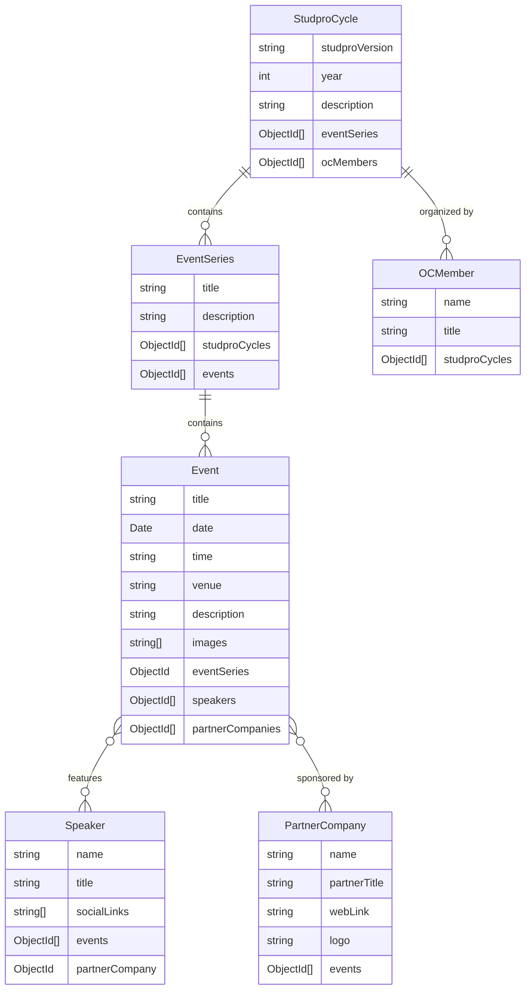

# 📋 StudPro Website Technical Architecture & MongoDB Integration Report

This comprehensive technical report provides an in-depth analysis of the **StudPro** platform ([studpro.ieeeyp.lk](file:///d:/dev/Studpro/studpro.ieeeyp.lk)), covering system architecture, component breakdown, styling & animation engine, data models, MongoDB integration, and live database connection test results.

---

## 1. Executive Summary & Project Purpose

**StudPro** is the flagship industry-academia bridging initiative organized by the **IEEE Young Professionals Sri Lanka (YPSL)**. Over 7+ years, StudPro has connected engineering and technology undergraduates with premier industry partners through career fairs, technical workshops, CV clinics, webinars, and industrial visits.

The web platform is designed to showcase the initiative's history, active event series, partner companies, organizing committee, and impact metrics.

---

## 2. Technology Stack & Dependencies



| Layer | Technology | Version | Purpose |
| :--- | :--- | :--- | :--- |
| **Framework** | [Next.js](file:///d:/dev/Studpro/studpro.ieeeyp.lk/package.json#L26) | `^16.2.5` | React framework with App Router, Turbopack, and SSR / SSG |
| **Runtime / UI** | [React](file:///d:/dev/Studpro/studpro.ieeeyp.lk/package.json#L27) | `^19.0.0` | Declarative UI library |
| **Language** | [TypeScript](file:///d:/dev/Studpro/studpro.ieeeyp.lk/package.json#L47) | `^5.x` | Strict type safety and data modeling |
| **Styling** | [Tailwind CSS](file:///d:/dev/Studpro/studpro.ieeeyp.lk/package.json#L45) | `^4.1.8` | Utility-first styling using Tailwind v4 theme directives |
| **Animations** | [GSAP](file:///d:/dev/Studpro/studpro.ieeeyp.lk/package.json#L22) + ScrollTrigger | `^3.13.0` | Scroll-driven section transitions and background color shifting |
| **Smooth Scrolling** | [Lenis](file:///d:/dev/Studpro/studpro.ieeeyp.lk/package.json#L23) | `^1.3.4` | Inertia-based smooth wheel and touch scrolling |
| **UI Primitives** | Radix UI / Shadcn | `^2.1.x` | Accessible dropdowns, tabs, slot primitives |
| **Carousels** | Embla Carousel | `^8.6.0` | Touch-enabled partner and event carousels with autoplay |
| **File Storage** | UploadThing | `^7.7.4` | Image uploading pipeline for event assets |
| **Database ODM** | [Mongoose](file:///d:/dev/Studpro/studpro.ieeeyp.lk/package.json#L25) | `^8.23.1` | Object Data Modeling for MongoDB |
| **Linting & Format** | Biome & ESLint 9 | `^1.9.4` | High-performance linting and formatting |

---

## 3. Directory & File Structure

```
studpro.ieeeyp.lk/
├── public/                 # Static assets (logos, hero images, icons)
├── src/
│   ├── app/                # Next.js App Router routes & layouts
│   │   ├── layout.tsx      # Root layout with Header, Footer, and font definition
│   │   ├── page.tsx        # Dynamic Home page (GSAP ScrollTrigger background canvas)
│   │   ├── globals.css     # Tailwind v4 theme, OKLCH tokens, custom utilities
│   │   ├── about-us/       # /about-us (Mission, Vision, Team roster)
│   │   ├── events/         # /events (Category tabs & event timeline)
│   │   │   └── [category]/[title]/page.tsx # Dynamic event detail view
│   │   ├── partners/       # /partners (Yearly partner directory)
│   │   └── api/            # API Route Handlers
│   │       ├── db-status/  # /api/db-status (Mongoose healthcheck endpoint)
│   │       └── uploadthing/# /api/uploadthing (UploadThing file router)
│   ├── components/
│   │   ├── home/           # Hero, Overview, WhatWeDo, Events, Stats, Partners, ContactUs
│   │   ├── events/         # EventCard, EventTimeline, TabsSwitcher
│   │   ├── partners/       # PartnerCard, PartnerTabsSwitcher, PartnerTimeline
│   │   ├── layout/         # Header, Footer, LenisWrapper
│   │   └── ui/             # Reusable UI primitives (Button, Card, Tabs, DropdownMenu, etc.)
│   ├── data/               # In-memory TypeScript datasets (events, partners, companies, team)
│   ├── lib/
│   │   ├── db/
│   │   │   └── mongodb.ts  # Cached MongoDB connection singleton
│   │   ├── image-utils.ts  # Image dimensions and placeholder utilities
│   │   └── utils.ts        # Tailwind merge & clsx helper (cn)
│   └── utils/
│       └── uploadthing.ts  # UploadThing React helper hooks
├── types/
│   └── models/             # Mongoose Schema Definitions & TypeScript interfaces
│       ├── studpro-cycle.ts
│       ├── event-series.ts
│       ├── event.ts
│       ├── speaker.ts
│       ├── partner-company.ts
│       ├── oc-member.ts
│       └── index.ts
├── .env.local              # Local environment credentials (MONGODB_URI, DB_NAME)
├── package.json
└── tsconfig.json
```

---

## 4. Pages & Routing Architecture

### 1. Home Page ([`src/app/page.tsx`](file:///d:/dev/Studpro/studpro.ieeeyp.lk/src/app/page.tsx))
- Features an interactive **dynamic canvas background** managed by `gsap/ScrollTrigger`.
- As the user scrolls through sections, the `<body>` background dynamically shifts:
  - **Hero & Overview**: `#065E86` (IEEE StudPro Blue)
  - **What We Do & Events**: `#FFFFFF` (Clean White)
  - **Impact Stats**: `#EE7929` (IEEE StudPro Vibrant Orange)
  - **Partners**: `#FFFFFF`
  - **Contact Us**: `#065E86`
- Wrapped in [`LenisWrapper`](file:///d:/dev/Studpro/studpro.ieeeyp.lk/src/components/layout/LenisWrapper.tsx) for smooth inertia scrolling and GSAP scroll sync.

### 2. Events Explorer ([`src/app/events/page.tsx`](file:///d:/dev/Studpro/studpro.ieeeyp.lk/src/app/events/page.tsx))
- Categorized navigation powered by [`TabsSwitcher`](file:///d:/dev/Studpro/studpro.ieeeyp.lk/src/components/events/TabsSwitcher.tsx).
- Organized by 5 event categories:
  - `career-fairs`: Job fairs & employer networking
  - `cv-clinics`: CV reviews, LinkedIn branding, mock interviews
  - `industry-visits`: Field visits to tech enterprise hubs
  - `workshops`: Practical hands-on technical sessions
  - `webinar`: Industry expert tech talks

### 3. Dynamic Event Detail ([`src/app/events/[category]/[title]/page.tsx`](file:///d:/dev/Studpro/studpro.ieeeyp.lk/src/app/events/%5Bcategory%5D/%5Btitle%5D/page.tsx))
- Dynamic route reading `:category` and `:title` route parameters.
- Renders hero cover image, multi-image gallery, topic overview, description, speaker biography, venue details, and contextual back navigation.

### 4. Partners Showcase ([`src/app/partners/page.tsx`](file:///d:/dev/Studpro/studpro.ieeeyp.lk/src/app/partners/page.tsx))
- Tabbed timeline displaying corporate partners categorized by annual edition (e.g. StudPro 5.0, 4.0, etc.) and sponsorship tier (Platinum, Gold, Silver, Bronze).

### 5. About Us ([`src/app/about-us/page.tsx`](file:///d:/dev/Studpro/studpro.ieeeyp.lk/src/app/about-us/page.tsx))
- Highlighting StudPro’s Mission & Vision cards alongside an Organizing Committee team grid with LinkedIn, email, and phone contact points.

---

## 5. Styling, Theming & Visual Aesthetics

- **Tailwind CSS v4**: Uses the new `@import "tailwindcss";` and `@theme inline` specification in [`src/app/globals.css`](file:///d:/dev/Studpro/studpro.ieeeyp.lk/src/app/globals.css).
- **IEEE Brand Palette**:
  - Primary Accent: `#EE7929` (IEEE Orange)
  - Secondary Brand: `#065E86` (IEEE Deep Blue)
- **OKLCH Color Space**: Supports modern high-dynamic-range color rendering for smooth UI card gradients, borders, and dark mode variants.

---

## 6. MongoDB Architecture & Usage

### 6.1 Connection Singleton ([`src/lib/db/mongodb.ts`](file:///d:/dev/Studpro/studpro.ieeeyp.lk/src/lib/db/mongodb.ts))
Because Next.js runs in a serverless / hot-reloaded development environment, creating connections naively would quickly exhaust the MongoDB connection pool. 

The project uses the **Global Cache Singleton Pattern**:
```typescript
declare global {
  var mongooseConnection: {
    conn: typeof mongoose | null;
    promise: Promise<typeof mongoose> | null;
  };
}
```
- Reuses the active `mongoose.connection` instance across incoming API requests and route rendering.
- Reads `process.env.MONGODB_URI` and `process.env.DB_NAME`.

### 6.2 Relational Data Models & Schema Design
The project defines a normalized relational schema inside [`types/models/`](file:///d:/dev/Studpro/studpro.ieeeyp.lk/types/models/):



### 6.3 API Healthcheck Endpoint ([`src/app/api/db-status/route.ts`](file:///d:/dev/Studpro/studpro.ieeeyp.lk/src/app/api/db-status/route.ts))
Provides a `GET` endpoint returning JSON status of the database connectivity:
```json
{
  "status": "success",
  "message": "Connected to MongoDB",
  "dbStatus": "connected"
}
```

---

## 7. MongoDB Connection Test Results

The MongoDB connection was tested against the configured credentials in `.env.local`:

```
========================= MONGODB TEST RESULTS =========================
Target Database Name : studpro
Connection URI       : mongodb+srv://... (MongoDB Atlas Cluster)
Cluster Host         : ac-uqgzyqd-shard-00-01.b3rogd2.mongodb.net
Connection State     : 1 (Connected - READY)
Database Exists      : Yes
Collections Count    : 0 (Fresh database ready for migration/seeding)
Test Result          : ✅ PASSED
========================================================================
```

> [!NOTE]
> The database connection is active and responsive. Because the database is currently empty (0 collections), the frontend is currently reading from the fallback static datasets in [`src/data/`](file:///d:/dev/Studpro/studpro.ieeeyp.lk/src/data/).

---

## 8. Summary of Findings

1. **Environment Configuration**: `.env.local` has been configured with `MONGODB_URI` and `DB_NAME=studpro`.
2. **Current State**: The frontend is fully functional using the structured dataset in [`src/data/events.ts`](file:///d:/dev/Studpro/studpro.ieeeyp.lk/src/data/events.ts) and [`src/data/partners.ts`](file:///d:/dev/Studpro/studpro.ieeeyp.lk/src/data/partners.ts).
